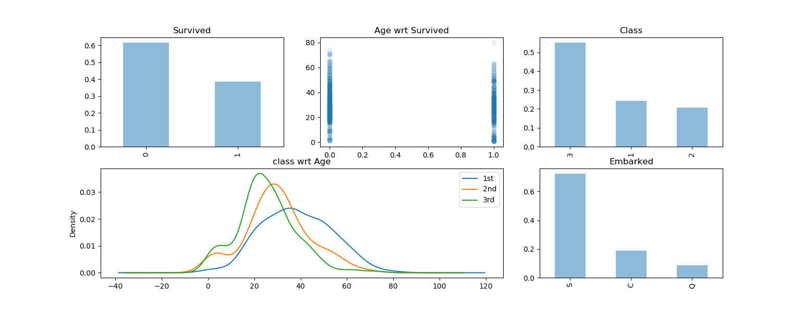
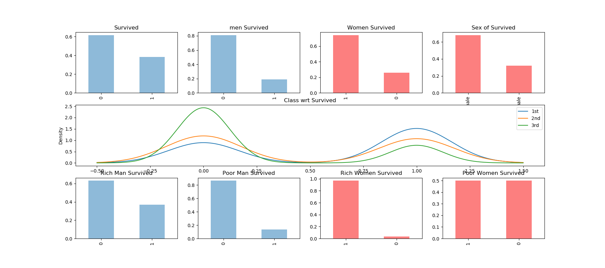
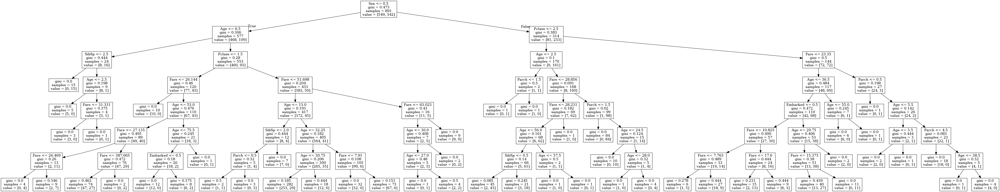

# Titanic-Machine-Learning-from-Disaster

### This is a solution for kaglle Titanic prediction challange

https://www.kaggle.com/c/titanic 
[Kaggle](https://www.kaggle.com/)

- Task is predict who is serviving and who has better servival rate

we have 10692 train data    
trian data set contain:         
* PassengerId   
* Survived  
* Pclass    
* Name  
* Sex   
* Age   
* SibSp     
* Parch     
* Ticket    
* Fare  
* Cabin     
* Embarked  

SO, Firstly i check how mane servivers are thier and map the servival relationship to get idea about the data

so i get the image with age and class.  

After that i create servived relation ship with gender

in that image i found a clear relationship servived with gender. lot of females are sevived according to data.      

after that i create hypothis that all female are servived and check with data
and i got 78% accuracy.[predict_gender.py]]

i use logistioc regression to get more accurace and i got 79%.

from decision tree model it got 97% accuracy but after normalize it finaly i got 81% accurace.

Used tech:
    
* python
* MatplotLib
* sklearn
* numpy
* pandas

Thank You!

Hirusha R.

